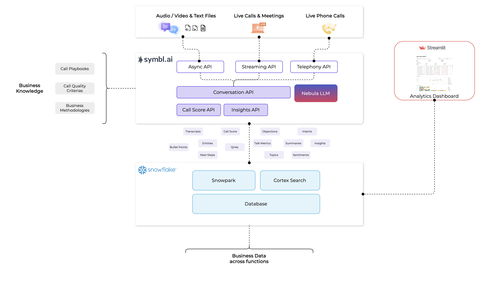

# Symbl Snowflake Integration with Python

This project demonstrates how to get started with integrating Symbl with Snowflake using Python, and build dashboard
using Streamlit.

<!-- TOC -->

* [Overview](#overview)
* [Prerequisites](#prerequisites)
* [Setup and Installation](#setup-and-installation)
* [Process Calls](#process-calls)
* [Start Streamlit Dashboard](#start-streamlit-dashboard)
* [Learn More](#learn-more)

<!-- TOC -->

## Overview

This is a sample project to demonstrate how to use Symbl's APIs to extract various insights from sales calls and
meetings, store them in the Snowflake database with sample CRM data, and build a dashboard using Streamlit to analyze
and build a co-pilot for sales analysis.
By merging unstructured calls data with existing structured business data, this integration helps you uncover
deeper insights, enabling more informed decision-making across customer service, sales, recruitment, and operations.



## Prerequisites

- Symbl.ai Account: Sign up for an account at [Symbl.ai](https://platform.symbl.ai) and retrieve your App ID and App
  Secret. Request access to Nebula API and get the Nebula API key.
- Snowflake Account: Sign up for a [Snowflake](https://signup.snowflake.com/) account and gather the necessary
  credentials (account ID, username, and password).
- Python 3.8 or higher: Ensure Python is installed on your local machine.

## Setup and Installation

The project has three main artifacts:

- [setup_snowflake_env.py](./setup_snowflake_env.py): sets up the Snowflake database and tables required for the
  project.
- [main.py](./main.py): processes the audio files, extracts insights using Symbl's APIs,
  and stores them in the Snowflake database.
- [streamlit](./streamlit): directory contains the dashboard for insights stored in the
  Snowflake.

Clone the repository and navigate to the project directory.

```shell
git clone https://github.com/symblai/snowflake-symbl-integration-python.git
cd snowflake-symbl-integration-python
```

Install the required dependencies by running -

```shell
pip install -r requirements.txt
```

Copy `secrets.toml.default` file to a new `secrets.toml` file.

```shell
cp secrets.toml.default secrets.toml
```

Update `secrets.toml` file with your Symbl and Snowflake credentials.

Once all values are updated, run the setup script to create the necessary tables in Snowflake.

```shell
python setup_snowflake_env.py
```

This will also copy your `secrets.toml` file to the `streamlit/.streamlit` directory so that the Streamlit app can
access the required credentials.

## Process Calls

You are now ready to run the `main.py` script to process the files and store the results in the Snowflake

```shell
python main.py
```

The `main.py` by default will use the sample transcripts and CRM data provided in the [data](./data) directory. You can
also provide your own data by updating the `main.py` script. You can modify it to also use your own audio files by
calling `submit_audio_file` function instead of `submit_transcript` function.

## Start Streamlit Dashboard

Once the script has finished running, you can start the Streamlit application to run the dashboard.

```shell
cd streamlit
streamlit run app.py
```

You can now access the Streamlit dashboard by navigating to `http://localhost:8501` in your browser.


## Optional: Install Streamlit App to Snowflake

If you have paid Snowflake account that is not in trial, you can optionally install Streamlit app to Snowflake to use
Snowpark so that it can access Symbl's Nebula API from within your Snowflake instance.

You can skip this step if you are using a trial account.

```shell
python setup_snowflake_env.py --install_streamlit_app
```

## Learn More

- [Symbl Docs](https://docs.symbl.ai/)
- [Snowflake Docs](https://docs.snowflake.com)
- [Streamlit Docs](https://docs.streamlit.io/)
